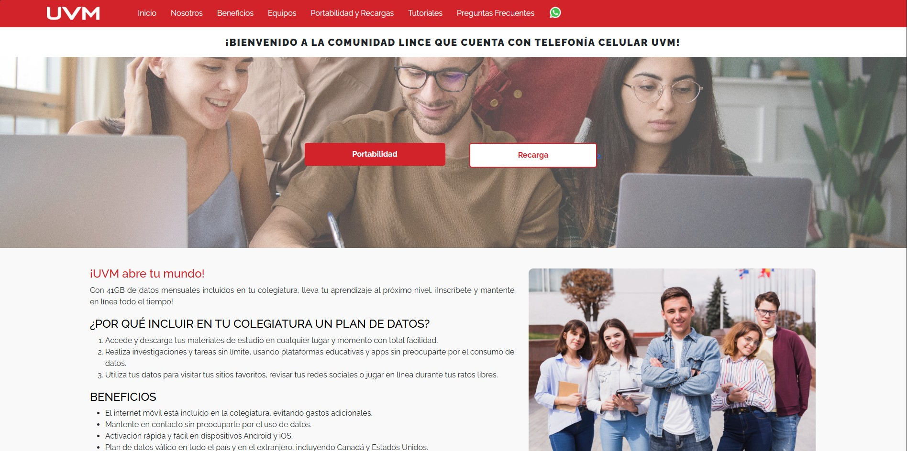

# 🌐 Development Web

Repositorio con proyectos de desarrollo web incluyendo CRUDs, gestores y landing pages.

---

## 📁 Proyectos

### 1. 🏢 Empresa - CRUD Básico
Sistema CRUD básico para gestión de una empresa con empleados y puestos. Incluye:
- Gestión de empleados
- Gestión de puestos
- Tema claro/oscuro
- Interfaz simple y funcional

**Tecnologías:** HTML, CSS, JavaScript, PHP, MySQL

#### 📹 Video Demostración
[](https://youtu.be/BAmU0X8EvMI)

#### 📸 Capturas de Pantalla

| Interfaz Usuario (Tema Claro) | Interfaz Usuario (Tema Oscuro) |
|:-----------------------------:|:------------------------------:|
|  |  |

| Interfaz Puestos (Tema Claro) | Interfaz Puestos (Tema Oscuro) |
|:-----------------------------:|:------------------------------:|
|  |  |

---

### 2. ⚽ FutLock - Gestor Avanzado
Sistema de gestión avanzado tipo CRUD con múltiples características:
- 📊 Dashboard con estadísticas
- 📦 Gestión de Inventario/Productos
- 👥 Gestión de Clientes
- 📋 Gestión de Pedidos
- 👨‍💼 Gestión de Empleados
- 💰 Gestión de Finanzas
- 🔐 Sistema de Login

**Tecnologías:** HTML, CSS, JavaScript, PHP, MySQL

#### 📹 Video Demostración
[](https://youtu.be/EeU91FxaKiw)

#### 📸 Capturas de Pantalla

| Dashboard | Gestión de Inventario |
|:---------:|:---------------------:|
|  |  |

| Gestión de Clientes | Gestión de Pedidos |
|:-------------------:|:------------------:|
|  |  |

| Gestión de Empleados | Gestión de Finanzas |
|:--------------------:|:-------------------:|
|  |  |

---

### 3. 🎓 Landing Page UVM
Landing page diseñada para la Universidad del Valle de México (UVM).
- Diseño moderno y responsive
- Secciones informativas
- Imágenes optimizadas en formato WebP

**Tecnologías:** HTML, CSS

#### 📸 Captura de Pantalla



---

## 📂 Estructura del Repositorio

```
📦 Development-Web
├── 📁 empresa/
│   ├── 📁 backend/
│   │   ├── db.php
│   │   └── endpoint.php
│   └── 📁 frontend/
│       ├── index.html
│       ├── script.js
│       └── styles.css
├── 📁 futlock/
│   ├── 📁 api/
│   ├── 📁 assets/
│   ├── 📁 css/
│   ├── 📁 js/
│   ├── dashboard.html
│   └── index.html
├── 📁 landing page/
│   ├── 📁 frontend/
│   └── 📁 images/
└── 📁 Preview/
    ├── 📁 Empresa/
    ├── 📁 FutLock/
    └── Landing_page_uvm.jpg
```

---

## 👤 Autor

**zzzwichol777**

---

⭐ Si te gustó este repositorio, ¡no olvides darle una estrella!
